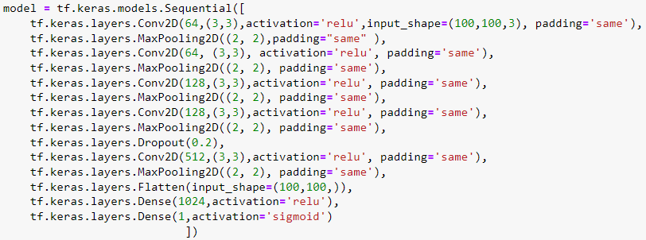
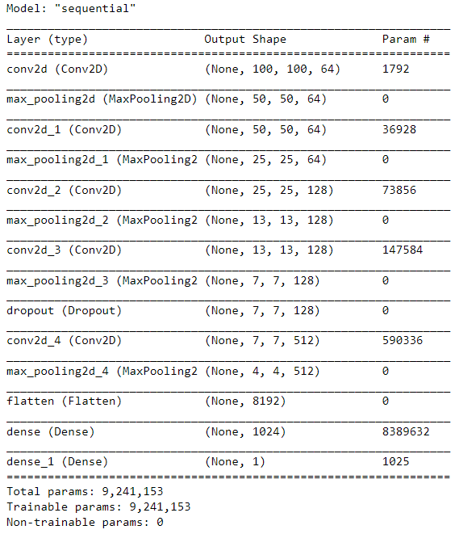
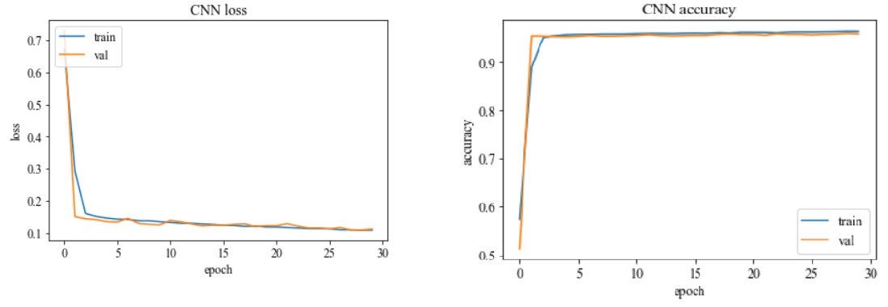
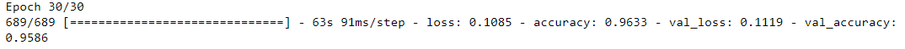
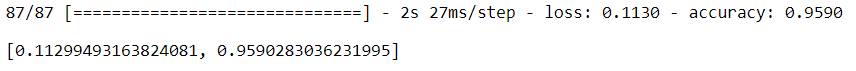
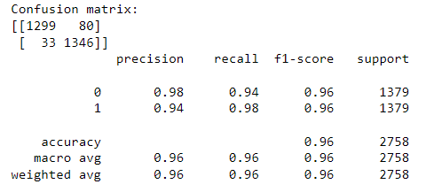
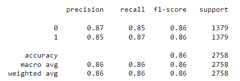
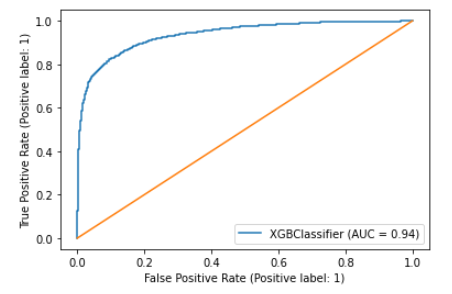
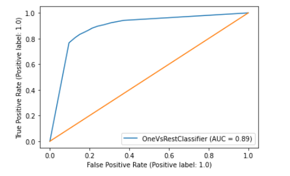
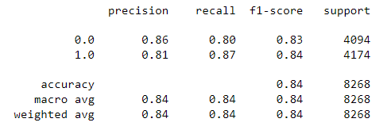

# Description:

This project is my bachelors degree capstone project of Universitie of Essex. This project was done solely by me by making use of [scikit-learn](https://scikit-learn.org/stable/index.html) and [XGBoost](https://xgboost.readthedocs.io/en/stable/index.html) open-source code demonstrations and documentations that helped implement SVM and XGBoost, as well as recieving knowledge and code exmaple from a book ["AI and Machine Learning for Coders by Laurence Moroney"](https://www.oreilly.com/library/view/ai-and-machine/9781492078180/) which helped me build my own CNN architecture from scratch.

The projects goal was to implement supervised machine learning classification algorthims together with pre-processing techniques that will classify P.flaciparum-infected red blood cell images. The results are then compared.

Dataset of cell images was taken from the National Institute of Health (NIH) containing 27,558 cell images with equal instances of parasitized and uninfected cells. The dataset can be downloaded on [NIH](https://lhncbc.nlm.nih.gov/LHC-downloads/downloads.html) under the tab "Dataset:Malaria Datasets" which contains more information on how the cell images were taken. The downloaded folder "nih_malaria" contains two files "parasitized" and "uninfected" which were divied into three subfolders. A new folder "cell_images" contains "train" folder with 80% of the total data while "train" and "val" contain 10% data each of the total data. These are used for XGBoost and CNN. The folders were split using the "split.py" code. SVM used 70% training data and 30% testing data, it's ratio can be changed in SVM.ipynb.

The obtained images had to be pre-processed and prepared before feeding them into the model. Proposed pre-processing methods for SVM were using Histogram Of oriented Gradients method.The images were recaled to into 64x128 pixels. XGBoost was pre-processed with HOG as well but had an aditional 180 degree rotation applied to a separate image, doubling the training dataset. CNN images were preprocessed differently. The images were augmented in real time, meaning the images were augmented just before being fed as training data. Random rotations up to 180 degrees clockwise or counter clockwise together with vertical and/or horizontal flips were done. Images were left in RGB and resized into 100x100 pixels.

# CNN
CNN architecture was made from scratch by me. It can be run from the file CNN.ipynb. The summary of the model together with it's parameters is depicted in the image bellow (image a.). The models information and results are shown bellow:

**CNN architecture:**

**CNN summary:**

**CNN history of loss and accuray an training and validation data:**

**CNN last training epoch results:**

**CNN evaluation on unseen testing data:**

**CNN precision, recall and f1-score:**

# XGBoost
XGBoost model was built with the help of [XGBoost documentation](https://xgboost.readthedocs.io/en/stable/index.html).  It can be run from the file XGBoost.ipynb. Hyper parameters were chosen by me as well as the preprocessing method. The performance of the model tested on testing data are shown bellow:

**XGBoost precision, recall and f1-score:**

**XGBoost AUC-ROC curve:**

# SVM
Due to quadratic time complexity I have used LinearSVC which is similar to SVC but is able to handle larger dataset samples. LinearSVC was used as a weak learner in Bagging.  It can be run from the file SVM.ipynb The results were: 

**SVM AUC-ROC curve:**

**SVM metrics:**

# Pre-Requisits
The libraries needed to run Support Vector Machine (SVM), Convolutional Neural Network (CNN) and eXtreme Gradient Boosting (XGBoost) are the ones listed bellow. I have used the [Anacodnda Distribution](https://www.anaconda.com/products/distribution) for simple library installation. Because tensorflow supports GPU I downloaded new libraries but it was hard to configure due to other librarie incompatabilities, but running on CPU will do just fine but slower. List of libraries:
 - [numpy](https://numpy.org/install/)
 - [matplotlib](https://matplotlib.org/stable/users/installing/index.html)
 - [xgboost](https://xgboost.readthedocs.io/en/latest/install.html)
 - [sklearn](https://scikit-learn.org/stable/install.html)
 - [opencv](https://docs.opencv.org/4.x/d5/de5/tutorial_py_setup_in_windows.html)
 - pickle
 - [joblib](https://joblib.readthedocs.io/en/latest/installing.html)
 - [tensorflow](https://www.tensorflow.org/install)
 - [keras](https://keras.io/getting_started/)
